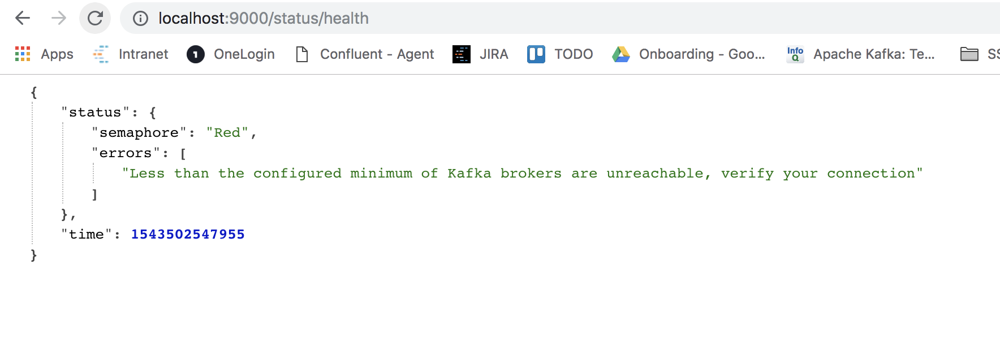

# Apache Kafka Health API

work in progress Apache Kafka Health API based on an small play framework app.

Note: This project is currently work in progress, not at all useful and will for 
sure have modifications. If you want to collaborate developing it you are more than welcome
to join forces.

## API

This is how it looks for now the very minimum API, you can expect this to be improving and moving 
as we develop this project.

